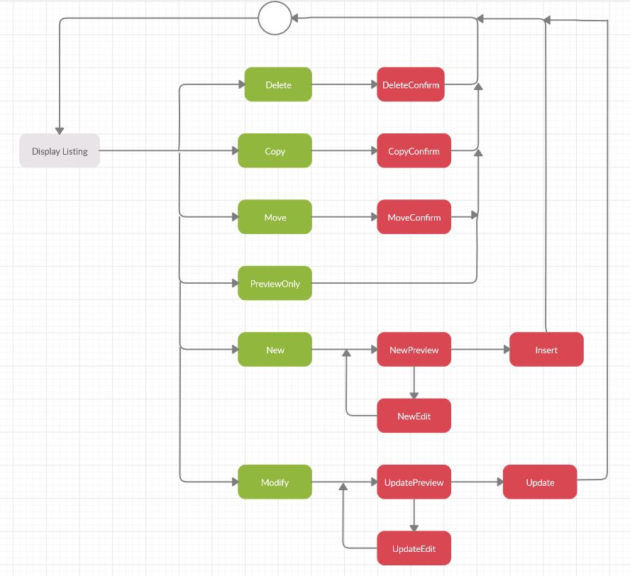
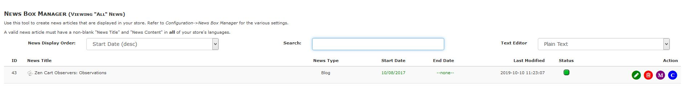
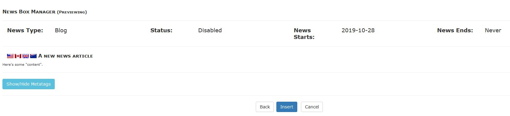
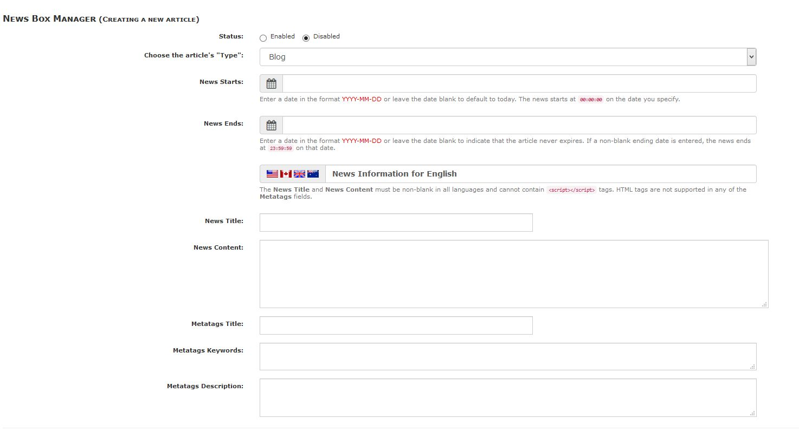
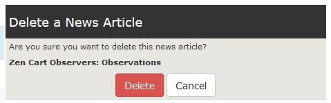
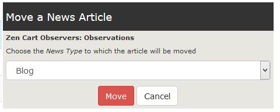
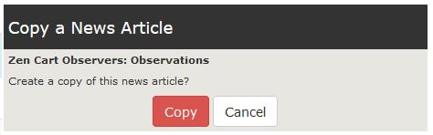

# Admin Tool Processing

The admin-level tool (_**Tools->News Box Manager**_) enables your store's admins to write and publish various news articles for your website. Let's look at a pictorial view first, refer to the descriptions that follow.

## News Box Manager &mdash; Admin Listing

Everything starts and ends with the news' listing display:

From there you can
- Sort the articles for display:
	1. By the articles' _Start Date_, either ascending or descending order.
	2. By the articles' _Status_, either those _Enabled_ or _Disabled_ first.
- Search for _words_ in the articles' titles and/or content.
- Choose your text-editor to be used when editing or creating an article.
- View a _read-only_ [Preview](#preview) of an article by clicking the teeny icon to the left of an article's name.
- Quickly toggle an article's _Status_ by clicking the green (currently enabled) or red (currently disabled) icon associated with an article.
	- Note that articles with empty titles and/or content **cannot** be enabled until the condition is resolved.
- [Edit](#edit-or-insert-an-article) an article by clicking the green-edit icon associated with the article or by clicking in any 'whitespace' on the row in which an article's information is displayed.
- [Insert](#edit-or-insert-an-article) an article by clicking the **Insert** button (not shown above) that appears at the end of the articles' listing.
- [Delete](#delete-an-article) an article by clicking the red-delete icon associated with the article.
- [Move](#move-an-article) an article to a different _News Type_ by clicking the purple-move icon associated with the article.
	- Only available when viewing **all* news articles.
- Make a [Copy](#copy-an-article) of an article in the current _News Type_ by clicking the blue-copy icon associated with the article. 

### Preview

When you 'Preview' an article, either in _read-only_ or pre-update/insert mode, that article's display will look similar to the following:

You can click the _Show/Hide Metatags_ button to toggle the display of those elements.  The _Insert_ (or _Update_) and _Cancel_ buttons display **only** when the article's preview is not in _read-only_ mode!

If you are creating or modifying an article, click _Back_ to return to the tool's editing display, _Insert_ (or _Update_) to save the article's information to the database or _Cancel_ to return to the tool's articles' listing (discarding any changes you've made).

### Edit or Insert an Article

When you 'Edit' an existing article or 'Insert' a new article, the next page displayed looks similar to the following &mdash; note that the article's information is filled in when it's being edited:

Simply follow the on-screen instructions to create/edit that article.  There is a 'hovering' set of **Preview** and **Cancel** buttons.  Click _Preview_ to validate the information and [preview](#preview) the article or click the _Cancel_ button to return to the articles' listing. 

### Delete an Article

When you click the _Delete_ icon associated with a news article, a sidebox:

is displayed.  Click the _Delete_ button to delete the article or click the _Cancel_ button to return to the articles' listing.

### Move an Article

When you click the _Move_ icon associated with a news article, a sidebox:

is displayed.  Choose the news "Type" to which the article is to be moved and click the _Move_ button to 'move' that article or click the _Cancel_ button to return to the articles' listing.

### Copy an Article
When you click the _Copy_ icon associated with a news article, a sidebox:

is displayed.  Click the _Copy_ button to create a copy of that article or click the _Cancel_ button to return to the articles' listing.