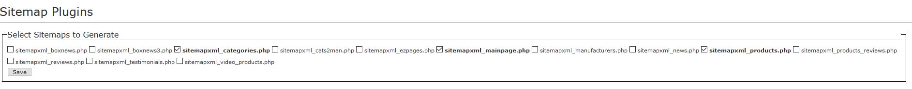
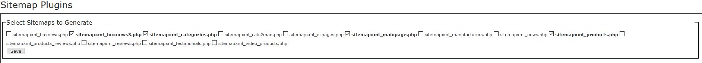

# Sitemap XML Integration

Starting with v3.1.0 of ***News Box Manager***, there's now a Sitemap XML integration, too!  The file 

`/includes/modules/pages/sitemapxml/sitemapxml_boxnews3.php`

enables your articles also to be posted to the various search engines and has been validated with ***Sitemap XML*** v3.9.5 and v3.9.6.  The ***Sitemap XML*** tool is pretty flexible, you just need to perform one additional step to provide that enablement.  

Within your Zen Cart admin, navigate to ***Tools::Sitemap XML***.  Towards the top of the screen, you'll see a section that looks similar to

Tick the box associated with `sitemapxml_boxnews3.php` and click the ***Save*** button.  That section now looks similar to

That's it!  Next time you generate your site's site-map, your articles will also be posted.