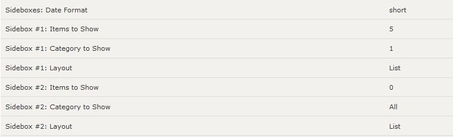
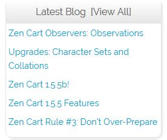
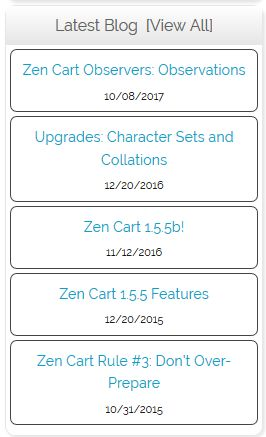
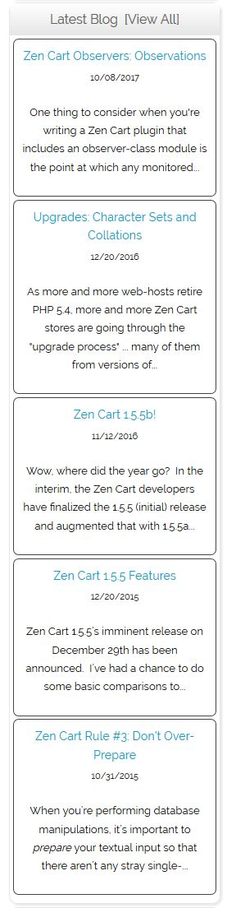
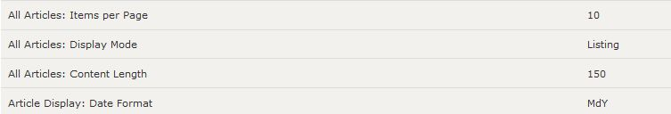
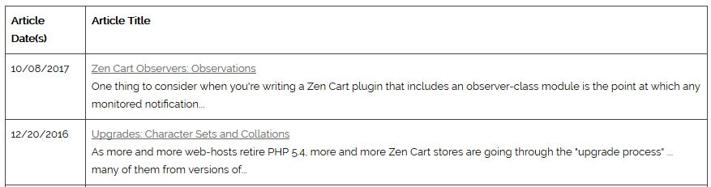
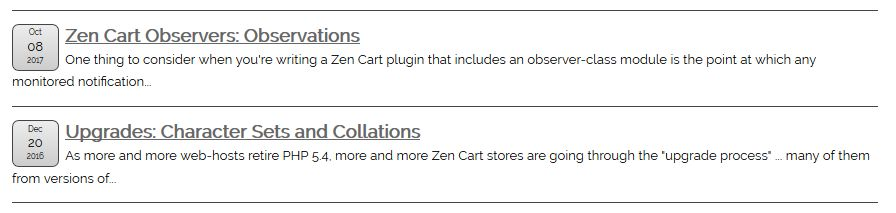
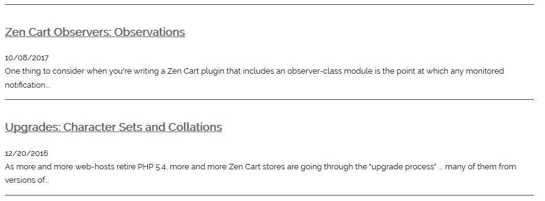

# Storefront Processing

The storefront processing for the **News Box Manager** provides:

1. Two (2) separately locateable sideboxes.
2. An `all_articles` page, where all active articles are displayed.
3. An `article` page, where the detailed content of a single article is displayed.

## Sidebox Display

Two storefront sideboxes (`news_box_sidebox` and `news_box_sidebox2`) are provided, enabling your store display different content types (using the admin's **Tools->Layout Boxes Controller**).  The sidebox configuration is controlled by the plugin's configuration settings:

 

Each sidebox can have a different layout, one of:

| List | GridTitleDate | GridTitleDateDesc |
| ---- | ---- | ---- |
|   |  |  |

## "All Articles" Display

The `all_articles` page (`news_archive` for plugin versions prior to 3.0.0), displays a running list of (er) all articles currently active for the store.  Its method of display is controlled by the plugin's configuration settings:

If the _Display Mode_ is set to `Table`, the listing displays similar to:

When the _Display Mode_ is set to `Listing`, the _Date Format_ also comes into play.  For an `MdY` date:

or for a `short` date:

In any case, clicking on an article's detailed link results in the `article` page (previously `more_news`) is displayed with the article's full content.
